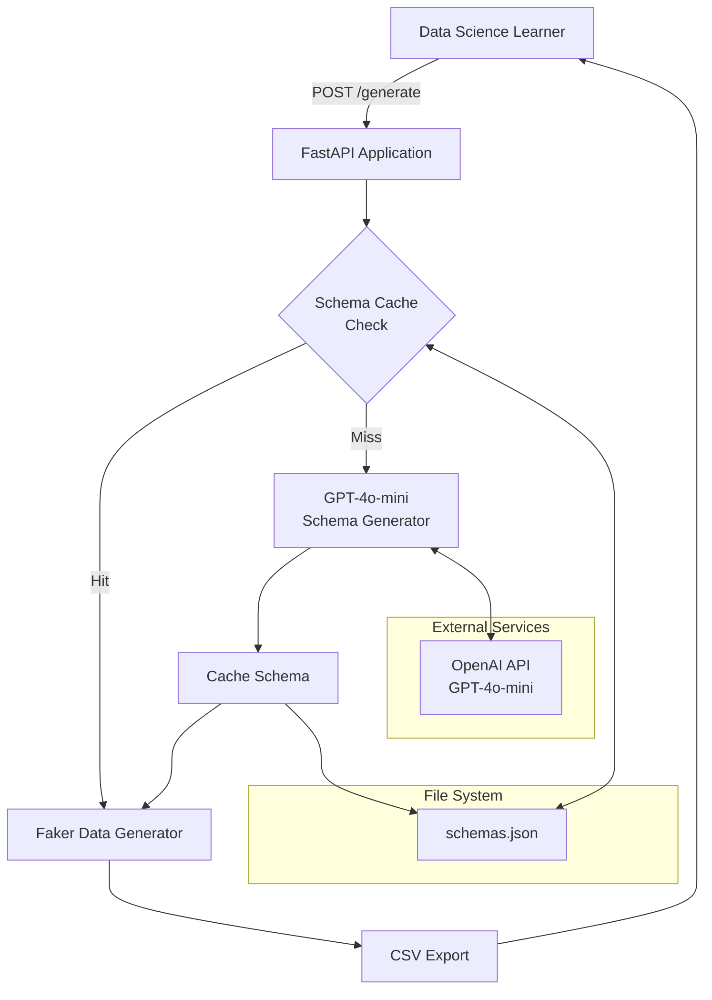
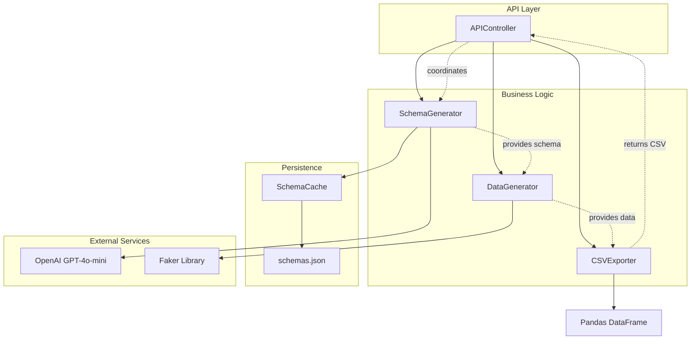
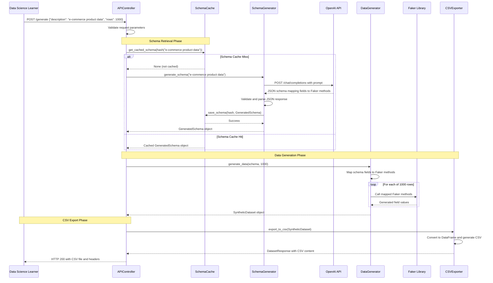
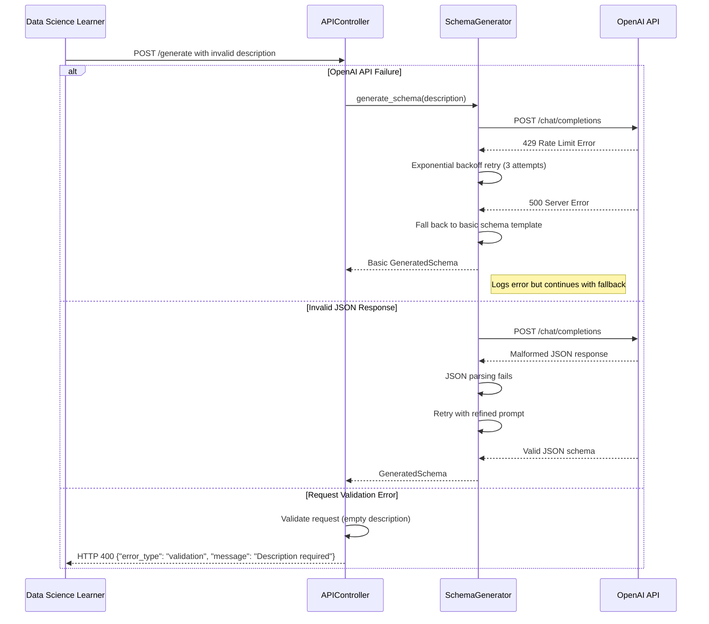
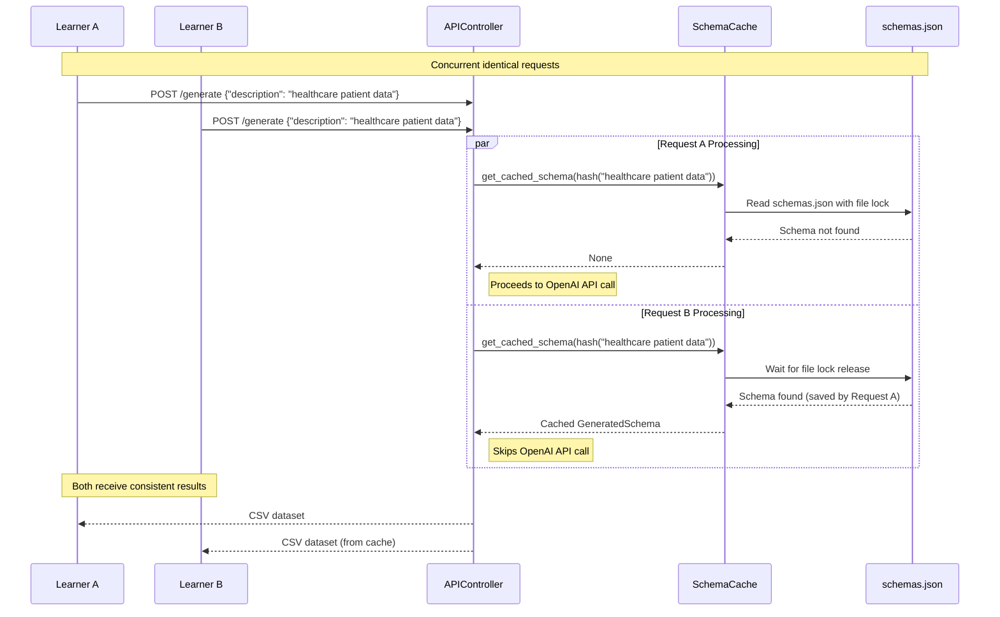

# Synthetic Data Generation Service Architecture Document

## Introduction

This document outlines the overall project architecture for Synthetic Data Generation Service, including backend systems, shared services, and non-UI specific concerns. Its primary goal is to serve as the guiding architectural blueprint for AI-driven development, ensuring consistency and adherence to chosen patterns and technologies.

**Relationship to Frontend Architecture:**
Since this is an API-only service with no user interface for the MVP, no separate Frontend Architecture Document is needed. This document covers the complete system architecture.

### Starter Template or Existing Project

Based on the PRD analysis, this is a greenfield project with no starter template mentioned. The project will be built from scratch using FastAPI as the foundation.

**Decision:** No starter template - manual setup required for all tooling and configuration, which aligns with the 1-hour MVP constraint and keeps the implementation focused and minimal.

### Change Log

| Date | Version | Description | Author |
|------|---------|-------------|---------|
| 2025-09-05 | 1.0 | Initial architecture document | Winston (Architect) |

## High Level Architecture

### Technical Summary

The Synthetic Data Generation Service employs a **simple monolithic REST API architecture** built on FastAPI, designed for rapid educational dataset creation. The system processes natural language descriptions through GPT-4o-mini to generate JSON schemas, which drive Faker-based synthetic data generation. Core components include an API gateway layer, an AI schema generator with file-based caching, and a data generation engine that outputs CSV files. This stateless, single-service design prioritizes implementation speed and cost efficiency while supporting the PRD's goal of reducing data acquisition time from hours to minutes for learning projects.

### High Level Overview

**1. Architectural Style:** **Monolithic REST API** - Single FastAPI application handling all functionality in one deployable unit, optimized for rapid development and simple operations.

**2. Repository Structure:** **Monorepo** - All service code, configuration, and schemas reside in a single repository as specified in the PRD, appropriate for the MVP's single-file implementation.

**3. Service Architecture:** **Single Service** - Stateless FastAPI application with no microservices decomposition, aligning with the 1-hour implementation constraint and educational use case focus.

**4. Primary User Flow:** User submits natural language description → System checks schema cache → If miss, calls GPT-4o-mini for schema generation → Faker generates synthetic data → Returns CSV file within 30 seconds.

**5. Key Architectural Decisions:**
- **File-based caching over database** - Reduces complexity and setup time while meeting caching requirements
- **Stateless design** - No user authentication or session management for MVP simplicity
- **Direct CSV response** - Eliminates need for file storage or download endpoints
- **Single endpoint architecture** - `/generate` handles the complete workflow

### High Level Project Diagram



### Architectural and Design Patterns

- **Repository Pattern:** Abstract schema caching operations - _Rationale:_ Enables future migration from file-based to database storage without changing business logic

- **Factory Pattern:** Schema-to-Faker method mapping - _Rationale:_ Provides flexible data type generation and supports custom domain-specific data creation

- **Caching Pattern:** Hash-based schema storage - _Rationale:_ Minimizes OpenAI API costs and improves response times for repeated requests, critical for educational use cases

- **Stateless Service Pattern:** No session or user state persistence - _Rationale:_ Simplifies implementation, improves scalability, and aligns with MVP requirements of no authentication

## Tech Stack

### Cloud Infrastructure

- **Provider:** None for MVP (local deployment)
- **Key Services:** N/A (file system only)
- **Deployment Regions:** Local development environment

### Technology Stack Table

| Category | Technology | Version | Purpose | Rationale |
|----------|------------|---------|---------|-----------|
| **Language** | Python | 3.12.0 | Primary development language | PRD requirement, modern features, excellent AI/ML ecosystem |
| **Framework** | FastAPI | 0.104.1 | REST API framework | PRD specified, rapid development, auto documentation |
| **ASGI Server** | Uvicorn | 0.24.0 | Application server | Standard FastAPI deployment, development server |
| **AI Integration** | OpenAI | 1.3.7 | GPT-4o-mini integration | PRD specified, official SDK, cost-effective model |
| **Data Generation** | Faker | 19.12.0 | Synthetic data creation | PRD specified, comprehensive data types, domain support |
| **Data Processing** | Pandas | 2.1.3 | CSV generation and manipulation | PRD specified, standard for data science workflows |
| **Configuration** | python-dotenv | 1.0.0 | Environment variable management | PRD specified, secure API key handling |
| **Development** | pyproject.toml | - | Dependency management with uv | Modern Python packaging, uv-based virtual env management |

## Data Models

### DatasetRequest

**Purpose:** Represents the incoming user request for synthetic data generation, capturing the natural language description and optional parameters.

**Key Attributes:**
- description: str - Natural language description of the desired dataset (required)
- rows: int - Number of data rows to generate (optional, defaults to 1000)
- format: str - Output format (defaults to "csv", future-proofing for other formats)

**Relationships:**
- One-to-one with GeneratedSchema (via description hash)
- One-to-one with DatasetResponse (request/response pair)

### GeneratedSchema

**Purpose:** Represents the JSON schema generated by GPT-4o-mini, mapping field names to Faker methods for data generation.

**Key Attributes:**
- description_hash: str - SHA-256 hash of the original description (cache key)
- schema: dict - JSON object mapping field names to Faker method specifications
- created_at: datetime - Timestamp for cache management
- domain: str - Inferred domain category (e-commerce, healthcare, etc.)

**Relationships:**
- Many-to-one with DatasetRequest (multiple requests can share same schema)
- One-to-one with SyntheticDataset (schema drives data generation)

### SyntheticDataset

**Purpose:** Represents the generated synthetic data before CSV conversion, containing the actual data records.

**Key Attributes:**
- data: List[Dict] - Array of generated data records
- row_count: int - Actual number of rows generated
- field_names: List[str] - Column headers extracted from schema
- generation_time: float - Time taken to generate data (performance tracking)

**Relationships:**
- One-to-one with GeneratedSchema (schema defines structure)
- One-to-one with DatasetResponse (data becomes CSV output)

### DatasetResponse

**Purpose:** Represents the final API response containing the CSV data and metadata.

**Key Attributes:**
- csv_content: str - Generated CSV data as string
- filename: str - Suggested filename based on description
- row_count: int - Number of rows in the dataset
- content_type: str - MIME type for HTTP response headers

**Relationships:**
- One-to-one with DatasetRequest (response to request)
- One-to-one with SyntheticDataset (CSV representation of data)

### ErrorResponse

**Purpose:** Standardized error response format for API failures and validation issues.

**Key Attributes:**
- error_type: str - Category of error (validation, generation, api_failure)
- message: str - Human-readable error description
- details: dict - Additional error context for debugging
- timestamp: datetime - When the error occurred

**Relationships:**
- Standalone model (no direct relationships to other entities)

## Components

Based on the architectural patterns, tech stack, and data models defined above, I've identified the major logical components for the Synthetic Data Generation Service:

### APIController

**Responsibility:** Handle HTTP requests, coordinate the data generation pipeline, and manage response formatting. Acts as the entry point for all client interactions with the service.

**Key Interfaces:**
- POST /generate - Accept dataset generation requests with natural language descriptions
- GET /health - System health check endpoint for monitoring

**Dependencies:** SchemaGenerator, DataGenerator, SchemaCache

**Technology Stack:** FastAPI framework with automatic request/response validation, OpenAPI documentation generation, and CORS middleware for cross-origin support

### SchemaGenerator

**Responsibility:** Transform natural language descriptions into JSON schemas compatible with Faker library methods. Handles OpenAI API integration and response parsing.

**Key Interfaces:**
- generate_schema(description: str) -> GeneratedSchema - Convert description to Faker-compatible schema
- validate_schema(schema: dict) -> bool - Ensure schema format is valid

**Dependencies:** OpenAI Python SDK, SchemaCache (for caching results)

**Technology Stack:** OpenAI Python SDK 1.3.7 for GPT-4o-mini integration, custom prompt templates for consistent schema generation, JSON validation for response parsing

### SchemaCache

**Responsibility:** Persist and retrieve generated schemas using description hash as cache key. Provides file-based storage with atomic read/write operations.

**Key Interfaces:**
- get_cached_schema(description_hash: str) -> Optional[GeneratedSchema] - Retrieve cached schema
- save_schema(description_hash: str, schema: GeneratedSchema) -> bool - Store new schema

**Dependencies:** File system (schemas.json), hashlib for description hashing

**Technology Stack:** JSON file-based persistence, SHA-256 hashing for cache keys, file locking mechanisms for concurrent access safety

### DataGenerator

**Responsibility:** Generate synthetic data based on schema specifications using Faker library. Handles data type mapping and ensures variety across generated records.

**Key Interfaces:**
- generate_data(schema: GeneratedSchema, row_count: int) -> SyntheticDataset - Create synthetic records
- map_schema_to_faker(schema: dict) -> dict - Convert schema fields to Faker method calls

**Dependencies:** Faker library, random module for domain-specific data

**Technology Stack:** Faker 19.12.0 for synthetic data generation, custom factory methods for unsupported data types, Pandas DataFrame integration for CSV export

### CSVExporter

**Responsibility:** Convert generated synthetic data into CSV format with proper headers and formatting. Handles content-type headers and filename suggestions.

**Key Interfaces:**
- export_to_csv(dataset: SyntheticDataset) -> DatasetResponse - Convert data to CSV format
- generate_filename(description: str) -> str - Create descriptive filename

**Dependencies:** Pandas library for DataFrame operations

**Technology Stack:** Pandas 2.1.3 for CSV generation, string manipulation utilities for filename creation, HTTP response header management

### Component Diagrams



## External APIs

Based on the PRD requirements and component design, the system requires integration with one external service:

### OpenAI API

- **Purpose:** Generate JSON schemas from natural language descriptions using GPT-4o-mini model for cost-effective synthetic data schema creation
- **Documentation:** https://platform.openai.com/docs/api-reference
- **Base URL(s):** https://api.openai.com/v1
- **Authentication:** Bearer token via OpenAI API key stored in environment variables
- **Rate Limits:** 3 requests per minute, 200 requests per day (free tier), up to 10,000 tokens per minute

**Key Endpoints Used:**
- `POST /chat/completions` - Submit natural language descriptions and receive structured JSON schemas compatible with Faker library methods

**Integration Notes:** 
- **Cost optimization:** Implement aggressive caching via SHA-256 hash of descriptions to minimize API calls for identical requests
- **Model specification:** Use "gpt-4o-mini" model specifically for cost efficiency while maintaining schema generation quality
- **Token management:** Keep prompts under 4000 tokens per PRD constraint, implement truncation if descriptions exceed limits
- **Error handling:** Implement retry logic with exponential backoff for rate limit errors, fallback to basic schema templates for API failures
- **Prompt engineering:** Use structured prompts that consistently return JSON objects mapping field names to Faker method calls
- **Response parsing:** Validate all responses contain valid JSON before processing, handle malformed responses gracefully

## Core Workflows

I'll illustrate the key system workflows using sequence diagrams to show component interactions and data flow:

### Primary Dataset Generation Workflow



### Error Handling Workflow



### Concurrent Request Handling



## REST API Spec

Since the project includes a REST API, I'll create an OpenAPI 3.0 specification based on the PRD requirements and data models:

```yaml
openapi: 3.0.0
info:
  title: Synthetic Data Generation Service API
  version: 1.0.0
  description: |
    REST API for generating custom synthetic datasets from natural language descriptions.
    Supports educational use cases with cost-optimized schema caching and CSV export.
    
    **Key Features:**
    - Natural language to synthetic data generation
    - GPT-4o-mini powered schema generation
    - Faker library integration for realistic data
    - Intelligent caching to minimize API costs
    - CSV export optimized for data science workflows

servers:
  - url: http://localhost:8000
    description: Local development server

paths:
  /generate:
    post:
      summary: Generate synthetic dataset from natural language description
      description: |
        Accepts a natural language description of desired dataset characteristics
        and returns a CSV file containing synthetic data matching the description.
        
        **Process:**
        1. Validates input description and parameters
        2. Checks cache for existing schema (SHA-256 hash of description)
        3. Generates schema via GPT-4o-mini if cache miss
        4. Generates synthetic data using Faker library
        5. Returns CSV file with appropriate headers
        
        **Performance:** Target response time <30 seconds per request.
      operationId: generateDataset
      requestBody:
        required: true
        content:
          application/json:
            schema:
              $ref: '#/components/schemas/DatasetRequest'
            examples:
              ecommerce:
                summary: E-commerce product dataset
                value:
                  description: "Generate e-commerce product data including product names, prices, categories, brands, and customer ratings for online store analysis"
                  rows: 1000
              healthcare:
                summary: Healthcare patient dataset
                value:
                  description: "Create healthcare patient records with demographics, medical conditions, treatment dates, and billing information for analysis"
                  rows: 500
              finance:
                summary: Financial transaction dataset
                value:
                  description: "Generate financial transaction data with account numbers, transaction types, amounts, dates, and merchant information"
                  rows: 2000
      responses:
        '200':
          description: Successfully generated CSV dataset
          headers:
            Content-Disposition:
              description: Suggested filename for the dataset
              schema:
                type: string
                example: 'attachment; filename="ecommerce_product_data.csv"'
            X-Row-Count:
              description: Number of rows in the generated dataset
              schema:
                type: integer
                example: 1000
            X-Generation-Time:
              description: Time taken to generate the dataset in seconds
              schema:
                type: number
                format: float
                example: 12.5
          content:
            text/csv:
              schema:
                type: string
                format: binary
                description: CSV file containing synthetic dataset with headers
              example: |
                product_name,price,category,brand,rating
                Wireless Bluetooth Headphones,89.99,Electronics,AudioTech,4.2
                Organic Cotton T-Shirt,24.95,Clothing,EcoWear,4.5
                Smart Home Security Camera,159.99,Electronics,SecureView,3.8
        '400':
          description: Invalid request parameters
          content:
            application/json:
              schema:
                $ref: '#/components/schemas/ErrorResponse'
              examples:
                empty_description:
                  summary: Missing description
                  value:
                    error_type: "validation"
                    message: "Description field is required and cannot be empty"
                    details:
                      field: "description"
                      provided_value: ""
                    timestamp: "2025-09-05T10:30:00Z"
                invalid_rows:
                  summary: Invalid row count
                  value:
                    error_type: "validation"
                    message: "Row count must be between 1 and 10000"
                    details:
                      field: "rows"
                      provided_value: 15000
                    timestamp: "2025-09-05T10:30:00Z"
        '429':
          description: Rate limit exceeded
          content:
            application/json:
              schema:
                $ref: '#/components/schemas/ErrorResponse'
              example:
                error_type: "rate_limit"
                message: "OpenAI API rate limit exceeded. Please try again in 60 seconds"
                details:
                  retry_after: 60
                  limit: "3 requests per minute"
                timestamp: "2025-09-05T10:30:00Z"
        '500':
          description: Internal server error
          content:
            application/json:
              schema:
                $ref: '#/components/schemas/ErrorResponse'
              example:
                error_type: "generation_failure"
                message: "Failed to generate synthetic data after multiple attempts"
                details:
                  last_error: "OpenAI API timeout"
                  fallback_used: true
                timestamp: "2025-09-05T10:30:00Z"

  /health:
    get:
      summary: Service health check
      description: Returns service status and basic system information
      operationId: healthCheck
      responses:
        '200':
          description: Service is healthy and operational
          content:
            application/json:
              schema:
                $ref: '#/components/schemas/HealthResponse'
              example:
                status: "healthy"
                version: "1.0.0"
                timestamp: "2025-09-05T10:30:00Z"
                dependencies:
                  openai_api: "available"
                  schema_cache: "accessible"
        '503':
          description: Service is temporarily unavailable
          content:
            application/json:
              schema:
                $ref: '#/components/schemas/HealthResponse'
              example:
                status: "unhealthy"
                version: "1.0.0"
                timestamp: "2025-09-05T10:30:00Z"
                dependencies:
                  openai_api: "unavailable"
                  schema_cache: "accessible"

components:
  schemas:
    DatasetRequest:
      type: object
      required:
        - description
      properties:
        description:
          type: string
          minLength: 10
          maxLength: 4000
          description: |
            Natural language description of the desired synthetic dataset.
            Should include domain context, field types, and any specific requirements.
          example: "Generate e-commerce product data with names, prices, categories, and ratings"
        rows:
          type: integer
          minimum: 1
          maximum: 10000
          default: 1000
          description: Number of data rows to generate
          example: 1500
        format:
          type: string
          enum: [csv]
          default: csv
          description: Output format (currently only CSV supported)

    ErrorResponse:
      type: object
      required:
        - error_type
        - message
        - timestamp
      properties:
        error_type:
          type: string
          enum: [validation, generation_failure, rate_limit, api_failure]
          description: Category of error that occurred
        message:
          type: string
          description: Human-readable error message
        details:
          type: object
          description: Additional context about the error
          additionalProperties: true
        timestamp:
          type: string
          format: date-time
          description: When the error occurred (ISO 8601 format)

    HealthResponse:
      type: object
      required:
        - status
        - version
        - timestamp
      properties:
        status:
          type: string
          enum: [healthy, unhealthy]
          description: Overall service health status
        version:
          type: string
          description: Service version identifier
        timestamp:
          type: string
          format: date-time
          description: Health check timestamp (ISO 8601 format)
        dependencies:
          type: object
          description: Status of external dependencies
          properties:
            openai_api:
              type: string
              enum: [available, unavailable, degraded]
            schema_cache:
              type: string
              enum: [accessible, inaccessible]
```

## Database Schema

Since the system uses file-based storage rather than a traditional database, I'll define the JSON schema structure for the schemas.json cache file:

### Schema Cache File Structure (schemas.json)

```json
{
  "cache_metadata": {
    "version": "1.0",
    "created_at": "2025-09-05T10:00:00Z",
    "last_updated": "2025-09-05T10:30:00Z",
    "total_schemas": 15
  },
  "schemas": {
    "a1b2c3d4e5f6...": {
      "description_hash": "a1b2c3d4e5f6789012345678901234567890abcdef1234567890abcdef123456",
      "original_description": "Generate e-commerce product data including product names, prices, categories, brands, and customer ratings for online store analysis",
      "schema": {
        "product_name": {
          "faker_method": "fake.company() + ' ' + fake.word().title()",
          "data_type": "string",
          "description": "Product name combining company and descriptive word"
        },
        "price": {
          "faker_method": "fake.pydecimal(left_digits=3, right_digits=2, positive=True)",
          "data_type": "decimal",
          "description": "Product price in USD"
        },
        "category": {
          "faker_method": "fake.random_element(['Electronics', 'Clothing', 'Books', 'Home & Garden', 'Sports'])",
          "data_type": "string",
          "description": "Product category"
        },
        "brand": {
          "faker_method": "fake.company()",
          "data_type": "string",
          "description": "Brand name"
        },
        "rating": {
          "faker_method": "fake.pyfloat(left_digits=1, right_digits=1, min_value=1.0, max_value=5.0)",
          "data_type": "float",
          "description": "Customer rating from 1.0 to 5.0"
        }
      },
      "domain": "e-commerce",
      "created_at": "2025-09-05T10:15:00Z",
      "usage_count": 3,
      "last_used": "2025-09-05T10:30:00Z"
    }
  }
}
```

## Source Tree

Based on the chosen repository structure (monorepo), service architecture (monolith), and tech stack (Python/FastAPI), here's the project folder structure:

```
synthetic-data-service/
├── pyproject.toml                 # uv dependency management and project config
├── uv.lock                        # uv lock file for reproducible builds
├── .env.example                   # Environment variable template
├── .gitignore                     # Git ignore patterns
├── README.md                      # Project documentation
├── main.py                        # FastAPI application entry point
├── src/
│   ├── __init__.py
│   ├── api/
│   │   ├── __init__.py
│   │   ├── routes.py              # FastAPI route definitions
│   │   └── models.py              # Pydantic request/response models
│   ├── services/
│   │   ├── __init__.py
│   │   ├── schema_generator.py    # OpenAI integration for schema generation
│   │   ├── data_generator.py      # Faker integration for data generation
│   │   ├── csv_exporter.py        # CSV export functionality
│   │   └── cache_service.py       # File-based schema caching
│   ├── core/
│   │   ├── __init__.py
│   │   ├── config.py              # Configuration management
│   │   ├── exceptions.py          # Custom exception classes
│   │   └── logging.py             # Logging configuration
│   └── utils/
│       ├── __init__.py
│       ├── file_operations.py     # File I/O utilities with locking
│       └── hash_utils.py          # SHA-256 hashing for cache keys
├── data/
│   ├── schemas.json               # Schema cache file (git-ignored)
│   └── schemas.json.backup        # Backup cache file (git-ignored)
├── tests/                         # Future test organization (manual testing for MVP)
│   ├── __init__.py
│   ├── test_api.py               # API endpoint tests
│   ├── test_services.py          # Service layer tests
│   └── fixtures/
│       └── sample_schemas.json   # Test data fixtures
├── docs/
│   ├── api.md                    # API documentation
│   └── examples/                 # Usage examples
│       ├── ecommerce_request.json
│       ├── healthcare_request.json
│       └── finance_request.json
└── scripts/
    ├── dev_setup.sh              # Development environment setup
    ├── run_local.sh              # Local development server script
    └── cache_cleanup.py          # Cache maintenance utilities
```

## Infrastructure and Deployment

### Infrastructure as Code

- **Tool:** Not applicable for MVP (local deployment only)
- **Location:** N/A
- **Approach:** Manual local setup, infrastructure as code deferred to post-MVP

### Deployment Strategy

- **Strategy:** Local development deployment via uvicorn
- **CI/CD Platform:** Not implemented for MVP (manual testing approach)
- **Pipeline Configuration:** N/A for MVP scope

### Environments

- **Development:** Local developer machine with uvicorn server - Full functionality including OpenAI API access and file-based caching
- **Production:** Not defined for MVP - Future consideration for educational platform integration

### Environment Promotion Flow

```
Development (Local) → [Future: Staging] → [Future: Production]
```

### Rollback Strategy

- **Primary Method:** Git revert to previous working commit
- **Trigger Conditions:** Service failures, API integration issues, or cache corruption
- **Recovery Time Objective:** <5 minutes (restart local server)

## Error Handling Strategy

### General Approach

- **Error Model:** Exception-based error handling with structured error responses
- **Exception Hierarchy:** Custom exceptions inheriting from base ApplicationError class
- **Error Propagation:** Bubble up with context, transform to HTTP responses at API boundary

### Logging Standards

- **Library:** Python standard logging module
- **Format:** Structured JSON logging for consistency
- **Levels:** DEBUG, INFO, WARNING, ERROR, CRITICAL with appropriate usage
- **Required Context:**
  - Correlation ID: UUID4 format for request tracking
  - Service Context: Component and method names
  - User Context: Request IP and timestamp (no personal data)

### Error Handling Patterns

#### External API Errors

- **Retry Policy:** Exponential backoff with max 3 attempts for OpenAI API calls
- **Circuit Breaker:** Not implemented for MVP (single external dependency)
- **Timeout Configuration:** 30 seconds for OpenAI API requests, 10 seconds for file operations
- **Error Translation:** Map OpenAI API errors to user-friendly messages

#### Business Logic Errors

- **Custom Exceptions:** ValidationError, SchemaGenerationError, DataGenerationError, CacheError
- **User-Facing Errors:** Structured JSON responses with error_type and user-friendly messages
- **Error Codes:** HTTP status codes (400, 429, 500) with detailed error_type field

#### Data Consistency

- **Transaction Strategy:** File-level locking for atomic cache operations
- **Compensation Logic:** Cache rollback on write failures
- **Idempotency:** Hash-based cache keys ensure identical requests produce identical results

## Coding Standards

### Core Standards

- **Languages & Runtimes:** Python 3.12.0 with type hints mandatory
- **Style & Linting:** Black formatter, no linter for MVP (time constraint)
- **Test Organization:** pytest structure ready for post-MVP implementation

### Critical Rules

- **Never log OpenAI API keys:** All sensitive data excluded from logs and error messages
- **Always use type hints:** Function signatures must include parameter and return types
- **File operations must use context managers:** Ensure proper resource cleanup
- **Cache operations must be atomic:** Use file locking to prevent corruption
- **All external API calls must have timeouts:** Prevent hanging requests

## Test Strategy and Standards

### Testing Philosophy

- **Approach:** Manual testing for MVP, automated testing framework prepared for post-MVP
- **Coverage Goals:** Not applicable for MVP (manual testing only)
- **Test Pyramid:** Future implementation will focus on unit tests for services, integration tests for API

### Test Types and Organization

#### Unit Tests

- **Framework:** pytest (ready for post-MVP)
- **File Convention:** test_*.py pattern in tests/ directory
- **Location:** tests/ directory mirroring src/ structure
- **Mocking Library:** pytest-mock for external dependencies
- **Coverage Requirement:** Not enforced for MVP

#### Integration Tests

- **Scope:** End-to-end API testing with mock OpenAI responses
- **Location:** tests/integration/
- **Test Infrastructure:**
  - **OpenAI API:** Mock responses using responses library
  - **File System:** Temporary directories for cache testing

#### End-to-End Tests

- **Framework:** Manual testing for MVP
- **Scope:** Complete user workflows from request to CSV response
- **Environment:** Local development environment
- **Test Data:** Sample requests covering all 5 required domains

## Security

### Input Validation

- **Validation Library:** Pydantic (built into FastAPI)
- **Validation Location:** API boundary before business logic processing
- **Required Rules:**
  - All external inputs MUST be validated against defined schemas
  - Description length limits enforced (10-4000 characters)
  - Row count limits enforced (1-10000 rows)

### Authentication & Authorization

- **Auth Method:** None for MVP (educational use case)
- **Session Management:** Stateless API design
- **Required Patterns:**
  - No authentication required per PRD specification
  - Future implementation should consider API key authentication

### Secrets Management

- **Development:** .env file with python-dotenv (git-ignored)
- **Production:** Environment variables (future implementation)
- **Code Requirements:**
  - NEVER hardcode OpenAI API keys
  - Access via environment variables only
  - No secrets in logs or error messages

### API Security

- **Rate Limiting:** Not implemented for MVP (delegated to OpenAI API limits)
- **CORS Policy:** Allow all origins for educational testing flexibility
- **Security Headers:** Basic FastAPI defaults
- **HTTPS Enforcement:** Not required for local development MVP

### Data Protection

- **Encryption at Rest:** Not implemented for MVP (local file system)
- **Encryption in Transit:** HTTPS for OpenAI API calls
- **PII Handling:** No personal data collection or storage
- **Logging Restrictions:** No user descriptions or generated data in logs

### Dependency Security

- **Scanning Tool:** Not implemented for MVP
- **Update Policy:** Pin specific versions in pyproject.toml
- **Approval Process:** Manual review for new dependencies

## Next Steps

After completing the architecture, proceed with the following actions:

### For Implementation

1. **Begin Story 1.1 Implementation:**
   - Set up Python project with uv
   - Create pyproject.toml with specified dependencies
   - Initialize FastAPI application structure

2. **Development Sequence:**
   - Implement core components following architecture design
   - Test with sample requests for each domain
   - Validate 30-second response time requirement

3. **Quality Assurance:**
   - Manual testing across all 5 required domains
   - Verify schema caching functionality
   - Test error handling scenarios

### Post-MVP Considerations

1. **Infrastructure Migration:**
   - Consider cloud deployment options
   - Implement proper CI/CD pipeline
   - Add monitoring and observability

2. **Feature Enhancements:**
   - Add authentication and rate limiting
   - Support additional output formats
   - Implement proper database storage

3. **Documentation:**
   - Create comprehensive API documentation
   - Add developer onboarding guide
   - Document deployment procedures