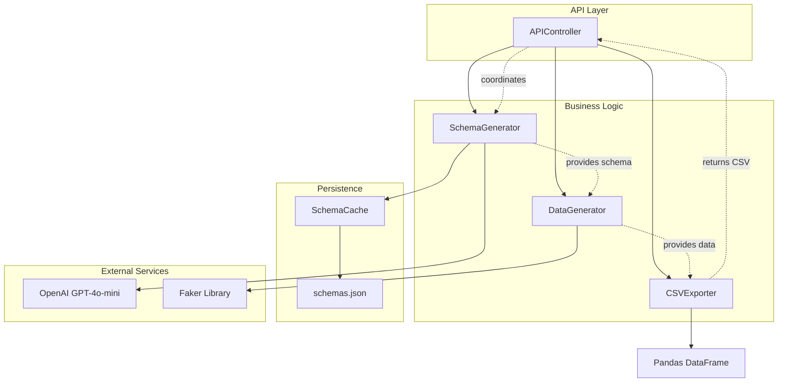

# Components

Based on the architectural patterns, tech stack, and data models defined above, I've identified the major logical components for the Synthetic Data Generation Service:

## APIController

**Responsibility:** Handle HTTP requests, coordinate the data generation pipeline, and manage response formatting. Acts as the entry point for all client interactions with the service.

**Key Interfaces:**
- POST /generate - Accept dataset generation requests with natural language descriptions
- GET /health - System health check endpoint for monitoring

**Dependencies:** SchemaGenerator, DataGenerator, SchemaCache

**Technology Stack:** FastAPI framework with automatic request/response validation, OpenAPI documentation generation, and CORS middleware for cross-origin support

## SchemaGenerator

**Responsibility:** Transform natural language descriptions into JSON schemas compatible with Faker library methods. Handles OpenAI API integration and response parsing.

**Key Interfaces:**
- generate_schema(description: str) -> GeneratedSchema - Convert description to Faker-compatible schema
- validate_schema(schema: dict) -> bool - Ensure schema format is valid

**Dependencies:** OpenAI Python SDK, SchemaCache (for caching results)

**Technology Stack:** OpenAI Python SDK 1.3.7 for GPT-4o-mini integration, custom prompt templates for consistent schema generation, JSON validation for response parsing

## SchemaCache

**Responsibility:** Persist and retrieve generated schemas using description hash as cache key. Provides file-based storage with atomic read/write operations.

**Key Interfaces:**
- get_cached_schema(description_hash: str) -> Optional[GeneratedSchema] - Retrieve cached schema
- save_schema(description_hash: str, schema: GeneratedSchema) -> bool - Store new schema

**Dependencies:** File system (schemas.json), hashlib for description hashing

**Technology Stack:** JSON file-based persistence, SHA-256 hashing for cache keys, file locking mechanisms for concurrent access safety

## DataGenerator

**Responsibility:** Generate synthetic data based on schema specifications using Faker library. Handles data type mapping and ensures variety across generated records.

**Key Interfaces:**
- generate_data(schema: GeneratedSchema, row_count: int) -> SyntheticDataset - Create synthetic records
- map_schema_to_faker(schema: dict) -> dict - Convert schema fields to Faker method calls

**Dependencies:** Faker library, random module for domain-specific data

**Technology Stack:** Faker 19.12.0 for synthetic data generation, custom factory methods for unsupported data types, Pandas DataFrame integration for CSV export

## CSVExporter

**Responsibility:** Convert generated synthetic data into CSV format with proper headers and formatting. Handles content-type headers and filename suggestions.

**Key Interfaces:**
- export_to_csv(dataset: SyntheticDataset) -> DatasetResponse - Convert data to CSV format
- generate_filename(description: str) -> str - Create descriptive filename

**Dependencies:** Pandas library for DataFrame operations

**Technology Stack:** Pandas 2.1.3 for CSV generation, string manipulation utilities for filename creation, HTTP response header management

## Component Diagrams

