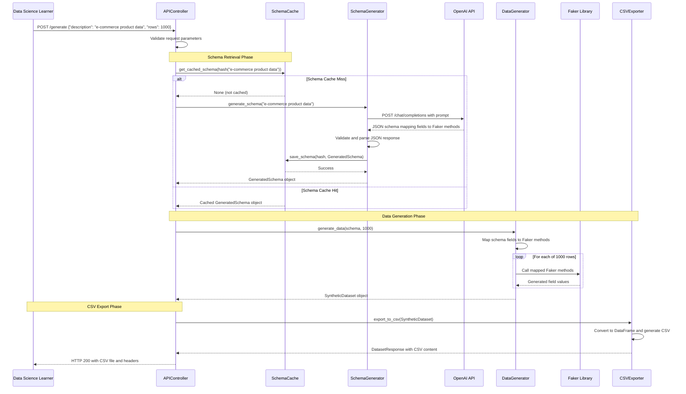
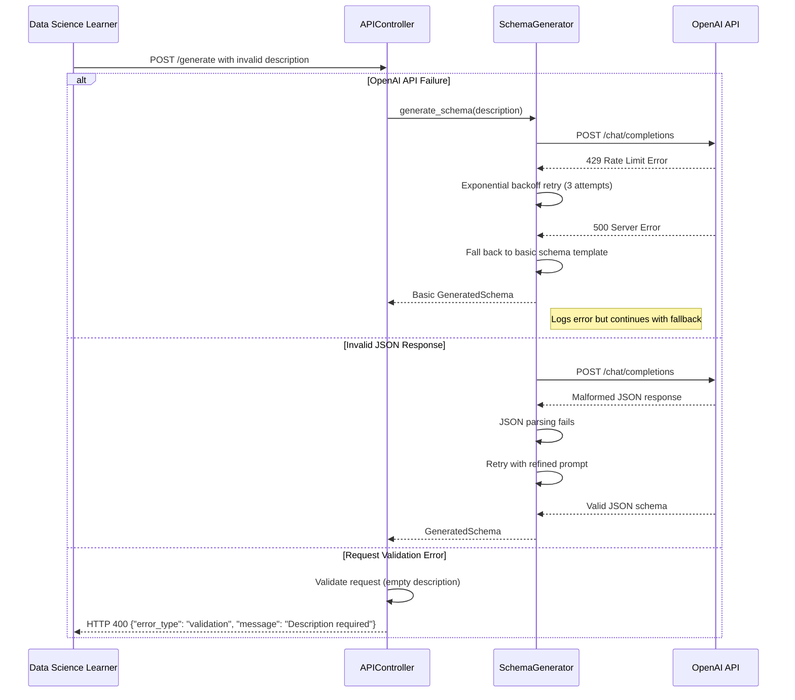
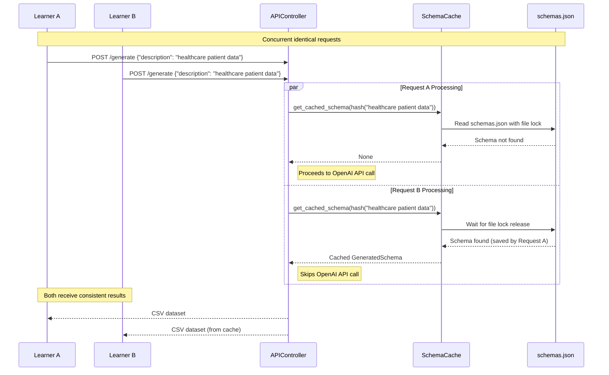

# Core Workflows

I'll illustrate the key system workflows using sequence diagrams to show component interactions and data flow:

## Primary Dataset Generation Workflow

## Error Handling Workflow

## Concurrent Request Handling

