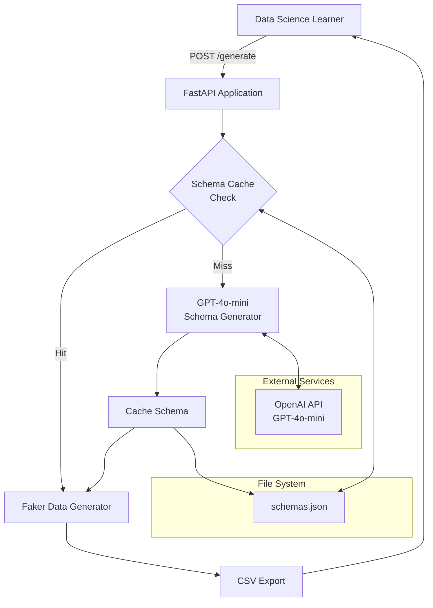

# High Level Architecture

## Technical Summary

The Synthetic Data Generation Service employs a **simple monolithic REST API architecture** built on FastAPI, designed for rapid educational dataset creation. The system processes natural language descriptions through GPT-4o-mini to generate JSON schemas, which drive Faker-based synthetic data generation. Core components include an API gateway layer, an AI schema generator with file-based caching, and a data generation engine that outputs CSV files. This stateless, single-service design prioritizes implementation speed and cost efficiency while supporting the PRD's goal of reducing data acquisition time from hours to minutes for learning projects.

## High Level Overview

**1. Architectural Style:** **Monolithic REST API** - Single FastAPI application handling all functionality in one deployable unit, optimized for rapid development and simple operations.

**2. Repository Structure:** **Monorepo** - All service code, configuration, and schemas reside in a single repository as specified in the PRD, appropriate for the MVP's single-file implementation.

**3. Service Architecture:** **Single Service** - Stateless FastAPI application with no microservices decomposition, aligning with the 1-hour implementation constraint and educational use case focus.

**4. Primary User Flow:** User submits natural language description → System checks schema cache → If miss, calls GPT-4o-mini for schema generation → Faker generates synthetic data → Returns CSV file within 30 seconds.

**5. Key Architectural Decisions:**
- **File-based caching over database** - Reduces complexity and setup time while meeting caching requirements
- **Stateless design** - No user authentication or session management for MVP simplicity
- **Direct CSV response** - Eliminates need for file storage or download endpoints
- **Single endpoint architecture** - `/generate` handles the complete workflow

## High Level Project Diagram

## Architectural and Design Patterns

- **Repository Pattern:** Abstract schema caching operations - _Rationale:_ Enables future migration from file-based to database storage without changing business logic

- **Factory Pattern:** Schema-to-Faker method mapping - _Rationale:_ Provides flexible data type generation and supports custom domain-specific data creation

- **Caching Pattern:** Hash-based schema storage - _Rationale:_ Minimizes OpenAI API costs and improves response times for repeated requests, critical for educational use cases

- **Stateless Service Pattern:** No session or user state persistence - _Rationale:_ Simplifies implementation, improves scalability, and aligns with MVP requirements of no authentication
